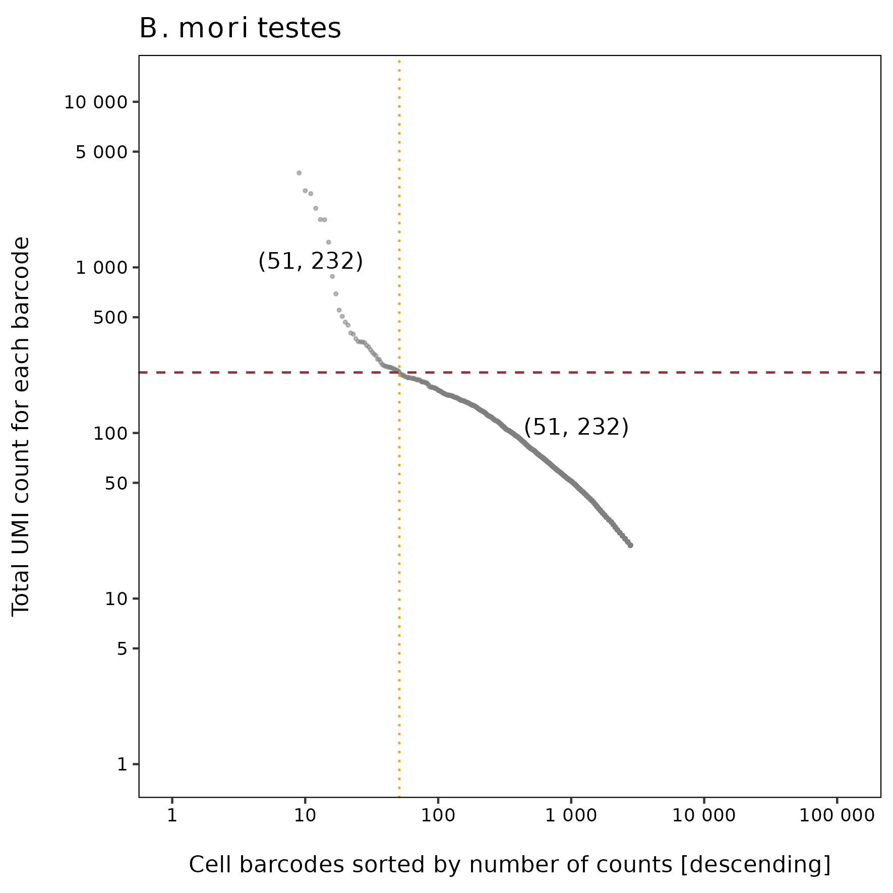
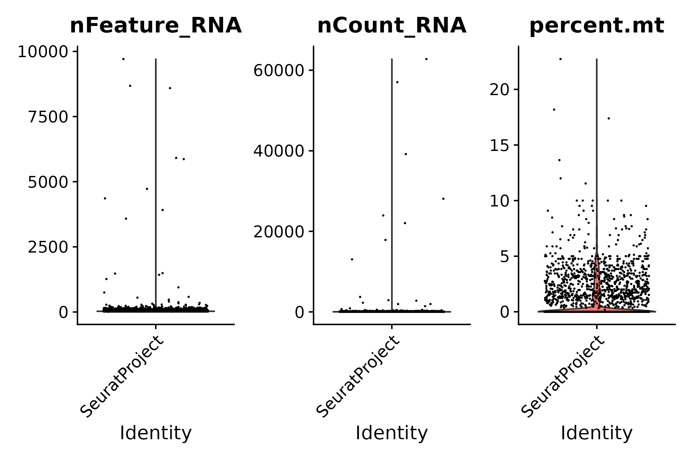
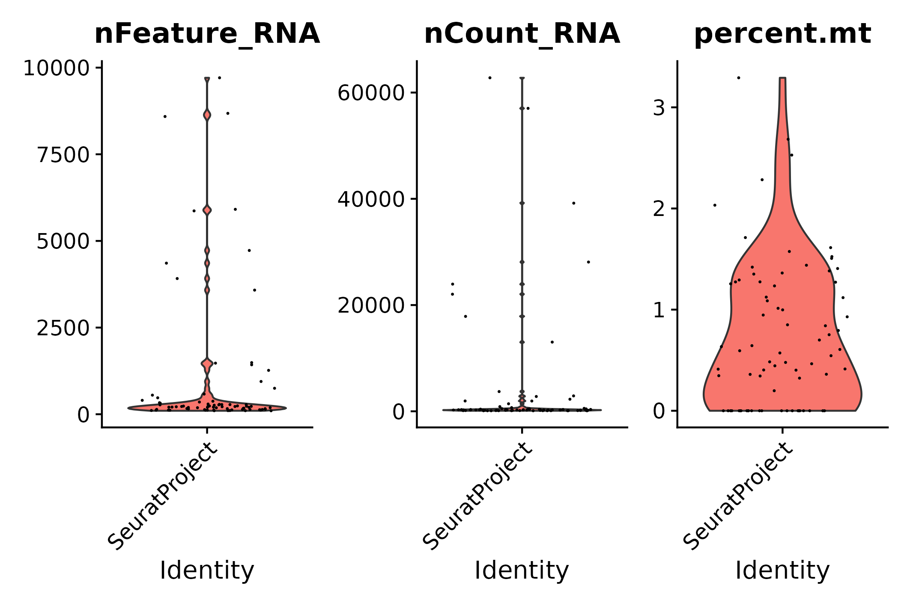
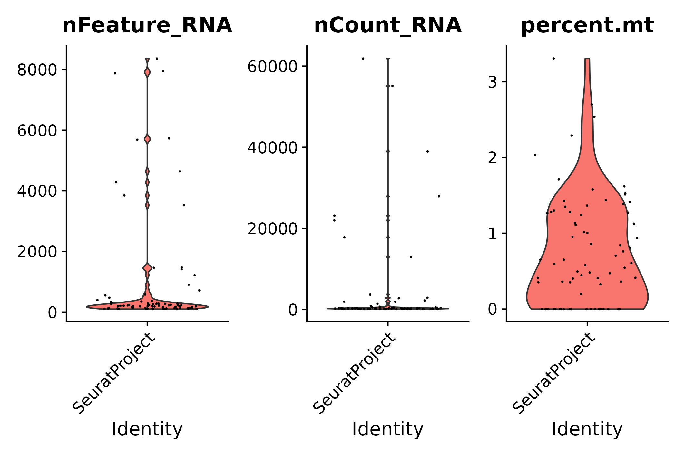
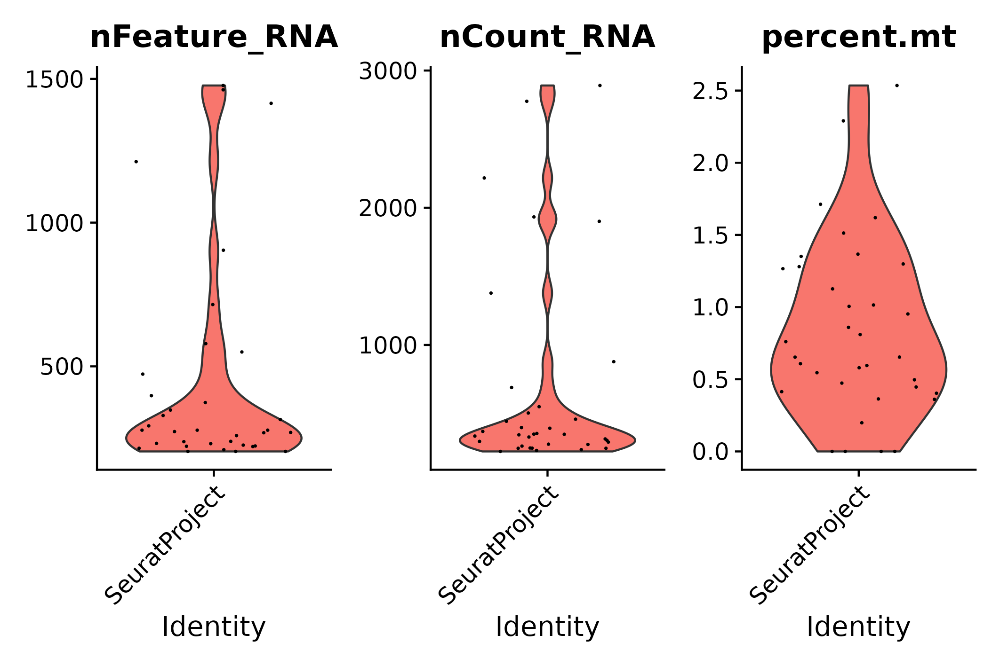
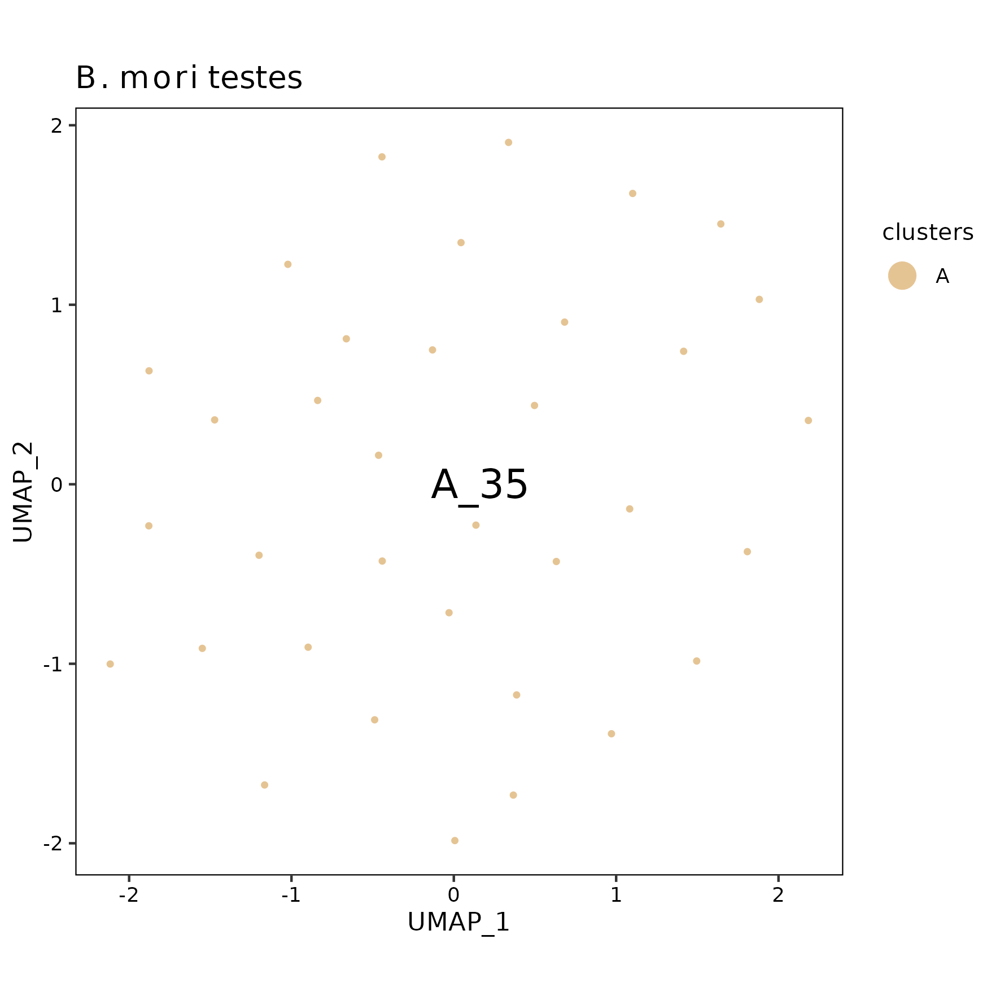

*B. mori* testes analysis using Drop-seq core computational protocol
================
Andrea Elizabeth Acurio Armas, Bulah Wu, Petr Nguyen  
October 16, 2024

### FastQC

Output can be found [here (read 1)](../shared/fastqc/read1/fastqc.md)
and [here (read 2)](../shared/fastqc/read2/fastqc.md).

 

### barcodeRanks()

The raw matrix is extracted by selecting cells that have ≥ 20 UMI
(suggested by [James
Nemesh](https://brain.broadinstitute.org/team/james_nemesh/)).

barcodeRanks() output

 

### emptyDrops()

|       | FALSE | TRUE |
|:------|------:|-----:|
| FALSE |   273 |   35 |
| TRUE  |     0 |   42 |

77 cells are identified.

 

### vlnplot()

- The raw matrix
  

  
  

  pre-emptydrops
  

  

|     |  Gene | Cell | Mean UMI/Cell | Median UMI/Cell | Mean Gene/Cell | Median Gene/Cell |
|:----|------:|-----:|--------------:|----------------:|---------------:|-----------------:|
| Raw | 11519 | 2843 |      153.9391 |              38 |       69.96342 |               34 |

 

- After emptyDrops()
  

  
  

  post-emptydrops
  

  

|  | Gene | Cell | Mean UMI/Cell | Median UMI/Cell | Mean Gene/Cell | Median Gene/Cell |
|:---|---:|---:|---:|---:|---:|---:|
| emptyDrops | 11519 | 77 | 3855.104 | 254 | 985 | 223 |

 

- STEP 1: filter genes detected in \< 3 cells
  

  
  

  seurat filter step 1
  

  

|       | Gene | Cell | Mean UMI/Cell | Median UMI/Cell | Mean Gene/Cell | Median Gene/Cell |
|:------|-----:|-----:|--------------:|----------------:|---------------:|-----------------:|
| Step1 | 8585 |   77 |      3795.896 |             253 |       936.8831 |              221 |

 

- STEP 2: filter cells that contain \< 200 genes detected
  

  
  

  seurat filter step 2
  

  

|       | Gene | Cell | Mean UMI/Cell | Median UMI/Cell | Mean Gene/Cell | Median Gene/Cell |
|:------|-----:|-----:|--------------:|----------------:|---------------:|-----------------:|
| Step2 | 8498 |   45 |      6377.689 |             393 |       1501.911 |              315 |

 

- STEP 3.1: following STEP 2, filter cells that contain ≤ 200 genes or ≥
  2500 genes detected
  

  
  

  seurat filter step 3.1
  

  

|  | Gene | Cell | Mean UMI/Cell | Median UMI/Cell | Mean Gene/Cell | Median Gene/Cell |
|:---|---:|---:|---:|---:|---:|---:|
| Step3.1 | 8498 | 35 | 672.9429 | 349 | 446.2286 | 278 |

 

- STEP 3.2: following STEP 2, filter cells that contain ≥ 5%
  mitochondrial counts
  

  
  

  seurat filter step 3.2
  

  

|  | Gene | Cell | Mean UMI/Cell | Median UMI/Cell | Mean Gene/Cell | Median Gene/Cell |
|:---|---:|---:|---:|---:|---:|---:|
| Step3.2 | 8498 | 45 | 6377.689 | 393 | 1501.911 | 315 |

 

- STEP 3: following STEP 2, filter cells that contain ≤ 200 genes or ≥
  2500 genes detected, and filter cells that contain ≥ 5% mitochondrial
  counts
  

  
  

  seurat filter step 3
  

  

|       | Gene | Cell | Mean UMI/Cell | Median UMI/Cell | Mean Gene/Cell | Median Gene/Cell |
|:------|-----:|-----:|--------------:|----------------:|---------------:|-----------------:|
| Step3 | 8498 |   35 |      672.9429 |             349 |       446.2286 |              278 |

 

- Summary

|  | Gene | Cell | Mean UMI/Cell | Median UMI/Cell | Mean Gene/Cell | Median Gene/Cell |
|:---|---:|---:|---:|---:|---:|---:|
| Raw | 11519 | 2843 | 153.9391 | 38 | 69.96342 | 34 |
| emptyDrops | 11519 | 77 | 3855.1039 | 254 | 985.00000 | 223 |
| Step1 | 8585 | 77 | 3795.8961 | 253 | 936.88312 | 221 |
| Step2 | 8498 | 45 | 6377.6889 | 393 | 1501.91111 | 315 |
| Step3.1 | 8498 | 35 | 672.9429 | 349 | 446.22857 | 278 |
| Step3.2 | 8498 | 45 | 6377.6889 | 393 | 1501.91111 | 315 |
| Step3 | 8498 | 35 | 672.9429 | 349 | 446.22857 | 278 |

 

### UMAP

umap

 
