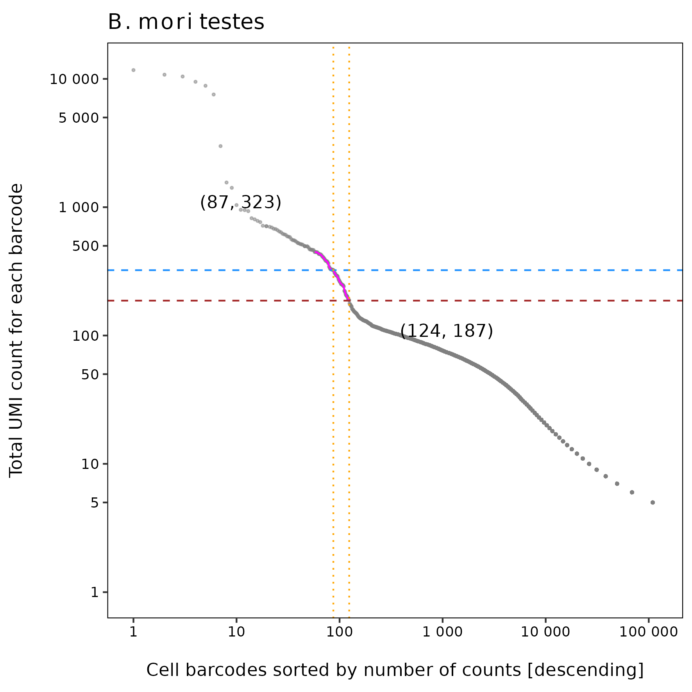
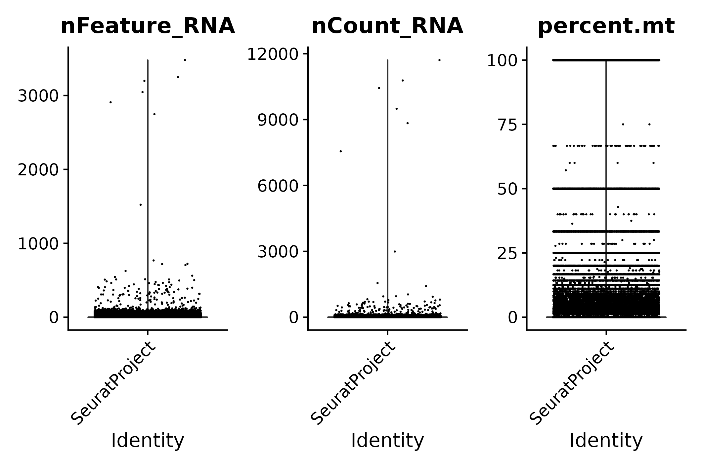
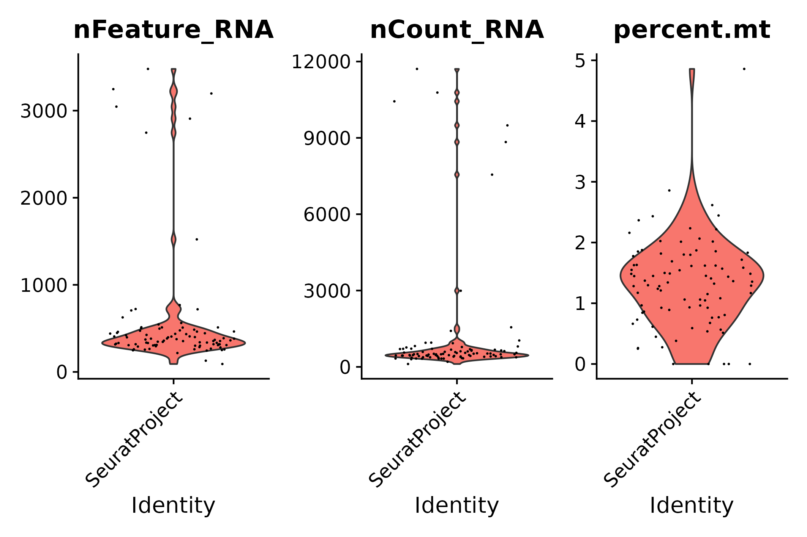
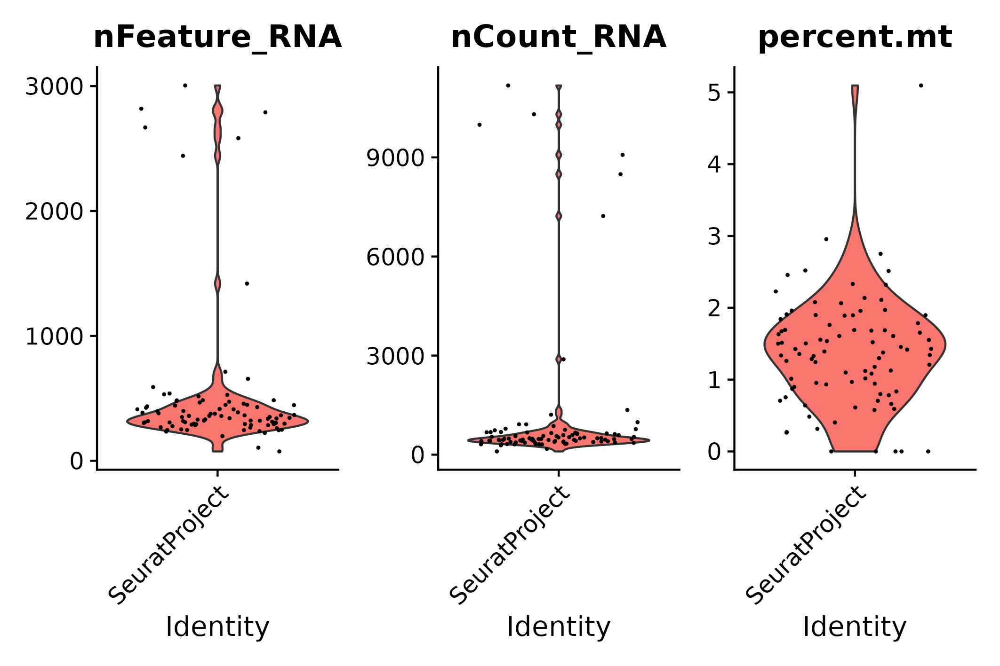
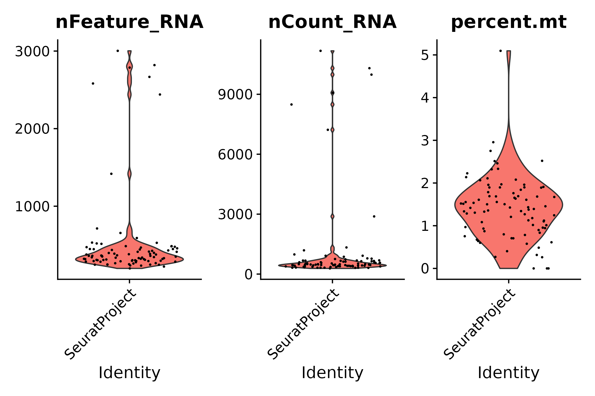
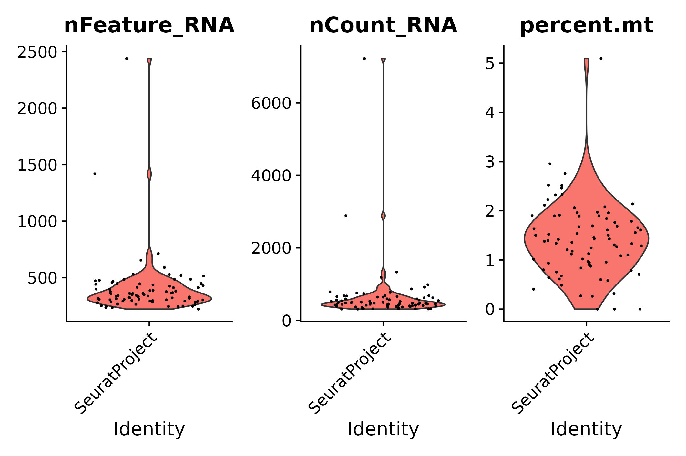
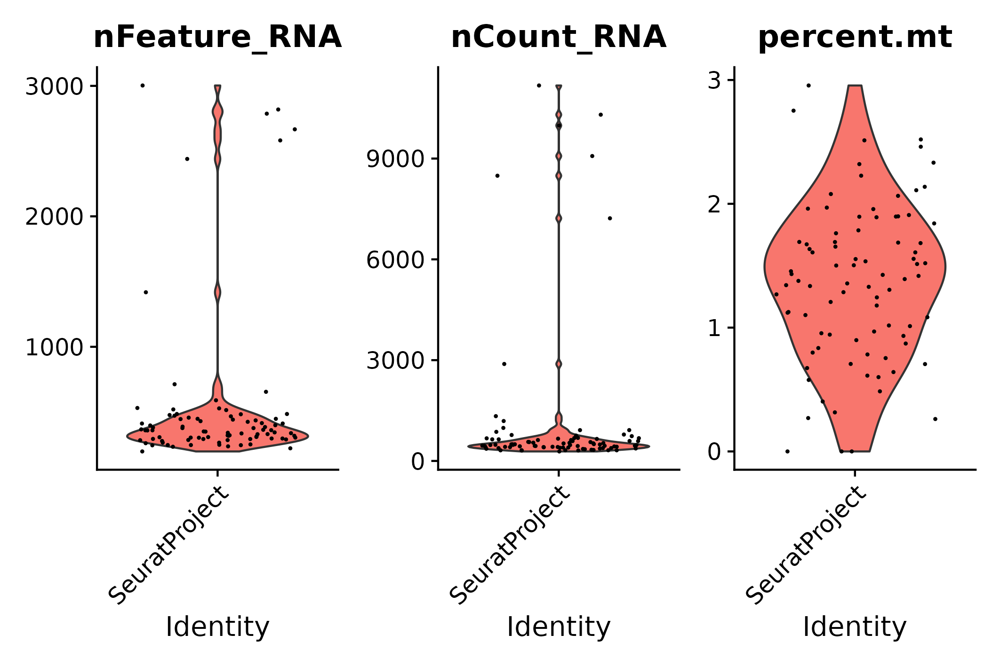
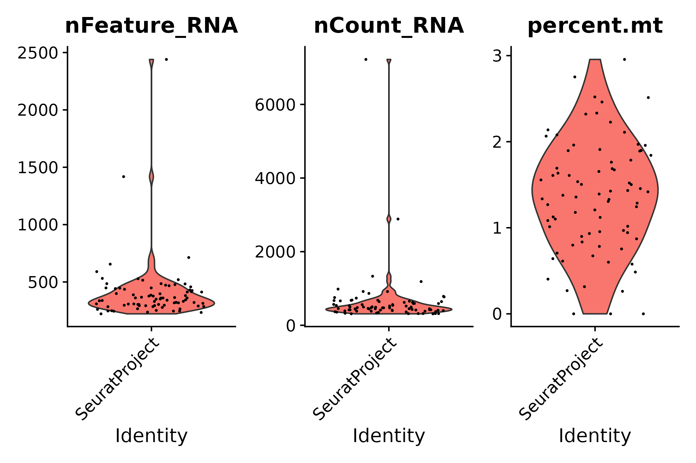
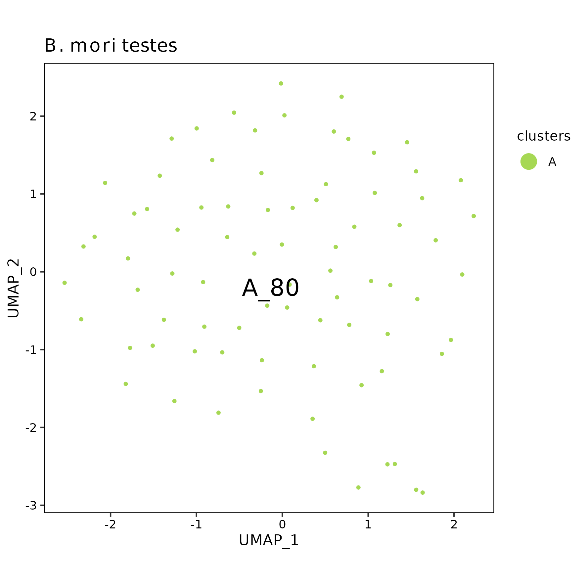

*B. mori* testes analysis using STARsolo raw matrix
================
Andrea Elizabeth Acurio Armas, Bulah Wu, Petr Nguyen  
October 16, 2024

 

### barcodeRanks()

barcodeRanks() output

 

### emptyDrops()

|       | FALSE | TRUE |
|:------|------:|-----:|
| FALSE |   289 |   39 |
| TRUE  |     0 |   50 |

89 cells are identified.

 

### vlnplot()

- The raw matrix
  

  
  

  pre-emptydrops
  

  

|  | Gene | Cell | Mean UMI/Cell | Median UMI/Cell | Mean Gene/Cell | Median Gene/Cell |
|:---|---:|---:|---:|---:|---:|---:|
| Raw | 18129 | 2998555 | 1.648681 | 1 | 1.601679 | 1 |

 

- After emptyDrops()
  

  
  

  post-emptydrops
  

  

|  | Gene | Cell | Mean UMI/Cell | Median UMI/Cell | Mean Gene/Cell | Median Gene/Cell |
|:---|---:|---:|---:|---:|---:|---:|
| emptyDrops | 18129 | 89 | 1192.843 | 496 | 578.8427 | 372 |

 

- STEP 1: filter genes detected in \< 3 cells
  

  
  

  seurat filter step 1
  

  

|       | Gene | Cell | Mean UMI/Cell | Median UMI/Cell | Mean Gene/Cell | Median Gene/Cell |
|:------|-----:|-----:|--------------:|----------------:|---------------:|-----------------:|
| Step1 | 4926 |   89 |      1139.247 |             479 |        528.573 |              351 |

 

- STEP 2: filter cells that contain \< 200 genes detected
  

  
  

  seurat filter step 2
  

  

|       | Gene | Cell | Mean UMI/Cell | Median UMI/Cell | Mean Gene/Cell | Median Gene/Cell |
|:------|-----:|-----:|--------------:|----------------:|---------------:|-----------------:|
| Step2 | 4904 |   87 |       1161.54 |             481 |       538.1494 |              359 |

 

- STEP 3.1: following STEP 2, filter cells that contain ≤ 200 genes or ≥
  2500 genes detected
  

  
  

  seurat filter step 3.1
  

  

|  | Gene | Cell | Mean UMI/Cell | Median UMI/Cell | Mean Gene/Cell | Median Gene/Cell |
|:---|---:|---:|---:|---:|---:|---:|
| Step3.1 | 4904 | 81 | 638.7901 | 474 | 404.4815 | 350 |

 

- STEP 3.2: following STEP 2, filter cells that contain ≥ 5%
  mitochondrial counts
  

  
  

  seurat filter step 3.2
  

  

|  | Gene | Cell | Mean UMI/Cell | Median UMI/Cell | Mean Gene/Cell | Median Gene/Cell |
|:---|---:|---:|---:|---:|---:|---:|
| Step3.2 | 4904 | 86 | 1169.57 | 485.5 | 540.6628 | 359.5 |

 

- STEP 3: following STEP 2, filter cells that contain ≤ 200 genes or ≥
  2500 genes detected, and filter cells that contain ≥ 5% mitochondrial
  counts
  

  
  

  seurat filter step 3
  

  

|       | Gene | Cell | Mean UMI/Cell | Median UMI/Cell | Mean Gene/Cell | Median Gene/Cell |
|:------|-----:|-----:|--------------:|----------------:|---------------:|-----------------:|
| Step3 | 4904 |   80 |      640.8875 |           476.5 |       405.5125 |            350.5 |

 

- Summary

|  | Gene | Cell | Mean UMI/Cell | Median UMI/Cell | Mean Gene/Cell | Median Gene/Cell |
|:---|---:|---:|---:|---:|---:|---:|
| Raw | 18129 | 2998555 | 1.648681 | 1.0 | 1.601679 | 1.0 |
| emptyDrops | 18129 | 89 | 1192.842697 | 496.0 | 578.842697 | 372.0 |
| Step1 | 4926 | 89 | 1139.247191 | 479.0 | 528.573034 | 351.0 |
| Step2 | 4904 | 87 | 1161.540230 | 481.0 | 538.149425 | 359.0 |
| Step3.1 | 4904 | 81 | 638.790124 | 474.0 | 404.481481 | 350.0 |
| Step3.2 | 4904 | 86 | 1169.569767 | 485.5 | 540.662791 | 359.5 |
| Step3 | 4904 | 80 | 640.887500 | 476.5 | 405.512500 | 350.5 |

 

### UMAP

umap

 
