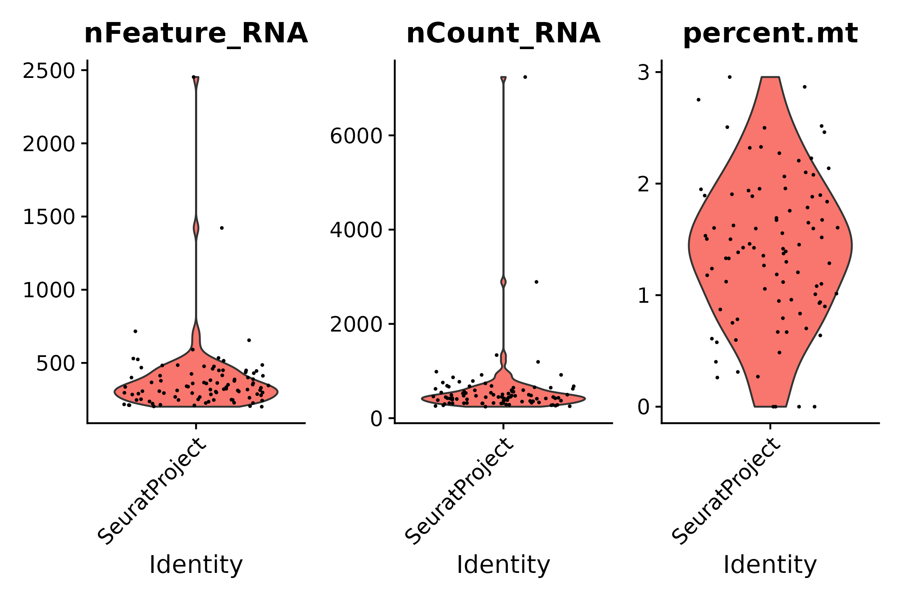

*B. mori* testes analysis using STARsolo filtered matrix
================
Andrea Elizabeth Acurio Armas, Bulah Wu, Petr Nguyen  
October 16, 2024

 

### barcodeRanks()

This is a filtered matrix processed by `STARsolo` using `emptyDrops()`.

 

### emptyDrops()

This is a filtered matrix processed by `STARsolo` using `emptyDrops()`.

 

### vlnplot()

- The raw matrix: this is exactly the raw matrix shown in “*B. mori*
  testes analysis using STARsolo raw matrix”.
  

  
  

  pre-emptydrops
  

  

|  | Gene | Cell | Mean UMI/Cell | Median UMI/Cell | Mean Gene/Cell | Median Gene/Cell |
|:---|---:|---:|---:|---:|---:|---:|
| Raw | 18129 | 2998555 | 1.648681 | 1 | 1.601679 | 1 |

 

- After emptyDrops()
  

  
  

  post-emptydrops
  

  

|  | Gene | Cell | Mean UMI/Cell | Median UMI/Cell | Mean Gene/Cell | Median Gene/Cell |
|:---|---:|---:|---:|---:|---:|---:|
| emptyDrops | 18129 | 5495 | 75.83767 | 51 | 58.84222 | 45 |

 

- STEP 1: filter genes detected in \< 3 cells
  

  
  

  seurat filter step 1
  

  

|       | Gene | Cell | Mean UMI/Cell | Median UMI/Cell | Mean Gene/Cell | Median Gene/Cell |
|:------|-----:|-----:|--------------:|----------------:|---------------:|-----------------:|
| Step1 | 8032 | 5495 |      75.22293 |              50 |       58.23203 |               45 |

 

- STEP 2: filter cells that contain \< 200 genes detected
  

  
  

  seurat filter step 2
  

  

|       | Gene | Cell | Mean UMI/Cell | Median UMI/Cell | Mean Gene/Cell | Median Gene/Cell |
|:------|-----:|-----:|--------------:|----------------:|---------------:|-----------------:|
| Step2 | 5023 |  104 |      1018.394 |           449.5 |       487.1442 |              327 |

 

- STEP 3.1: following STEP 2, filter cells that contain ≤ 200 genes or ≥
  2500 genes detected
  

  
  

  seurat filter step 3.1
  

  

|  | Gene | Cell | Mean UMI/Cell | Median UMI/Cell | Mean Gene/Cell | Median Gene/Cell |
|:---|---:|---:|---:|---:|---:|---:|
| Step3.1 | 5023 | 94 | 590.266 | 449.5 | 379.9574 | 327 |

 

- STEP 3.2: following STEP 2, filter cells that contain ≥ 5%
  mitochondrial counts
  

  
  

  seurat filter step 3.2
  

  

|  | Gene | Cell | Mean UMI/Cell | Median UMI/Cell | Mean Gene/Cell | Median Gene/Cell |
|:---|---:|---:|---:|---:|---:|---:|
| Step3.2 | 5023 | 103 | 1023.689 | 449 | 488.7282 | 330 |

 

- STEP 3: following STEP 2, filter cells that contain ≤ 200 genes or ≥
  2500 genes detected, and filter cells that contain ≥ 5% mitochondrial
  counts
  

  
  

  seurat filter step 3
  

  

|       | Gene | Cell | Mean UMI/Cell | Median UMI/Cell | Mean Gene/Cell | Median Gene/Cell |
|:------|-----:|-----:|--------------:|----------------:|---------------:|-----------------:|
| Step3 | 5023 |   93 |      591.5269 |             449 |       380.5591 |              330 |

 

- Summary

|  | Gene | Cell | Mean UMI/Cell | Median UMI/Cell | Mean Gene/Cell | Median Gene/Cell |
|:---|---:|---:|---:|---:|---:|---:|
| Raw | 18129 | 2998555 | 1.648681 | 1.0 | 1.601679 | 1 |
| emptyDrops | 18129 | 5495 | 75.837671 | 51.0 | 58.842220 | 45 |
| Step1 | 8032 | 5495 | 75.222930 | 50.0 | 58.232029 | 45 |
| Step2 | 5023 | 104 | 1018.394231 | 449.5 | 487.144231 | 327 |
| Step3.1 | 5023 | 94 | 590.265957 | 449.5 | 379.957447 | 327 |
| Step3.2 | 5023 | 103 | 1023.689320 | 449.0 | 488.728155 | 330 |
| Step3 | 5023 | 93 | 591.526882 | 449.0 | 380.559140 | 330 |

 

- STARsolo summary

This summary is generated by `STARsolo`.

| Measurement                                 | Value     |
|:--------------------------------------------|:----------|
| Number of Reads                             | 86056925  |
| Reads With Valid Barcodes                   | 1         |
| Sequencing Saturation                       | 0.847658  |
| Q30 Bases in CB+UMI                         | -nan      |
| Q30 Bases in RNA read                       | 0.823021  |
| Reads Mapped to Genome (Unique+Multiple)    | 0.877685  |
| Reads Mapped to Genome (Unique)             | 0.845328  |
| Reads Mapped to Gene (Unique+Multiple Gene) | NoMulti   |
| Reads Mapped to Gene (Unique Gene)          | 0.377088  |
| Estimated Number of Cells                   | 5495      |
| Unique Reads in Cells Mapped to Gene        | 2656653   |
| Fraction of Unique Reads in Cells           | 0.0818666 |
| Mean Reads per Cell                         | 483       |
| Median Reads per Cell                       | 128       |
| UMIs in Cells                               | 416728    |
| Mean UMI per Cell                           | 75        |
| Median UMI per Cell                         | 51        |
| Mean Gene per Cell                          | 58        |
| Median Gene per Cell                        | 45        |
| Total Gene Detected                         | 10481     |

 

### UMAP

umap

 
