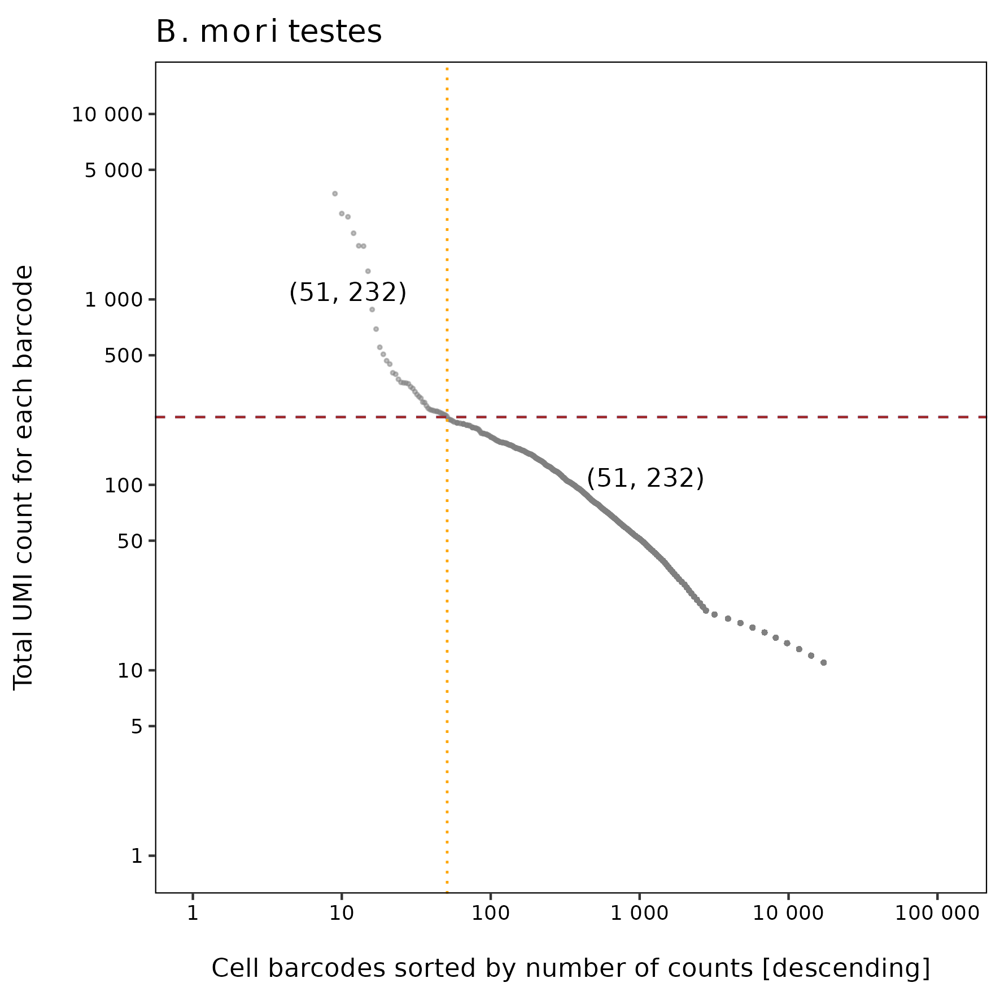
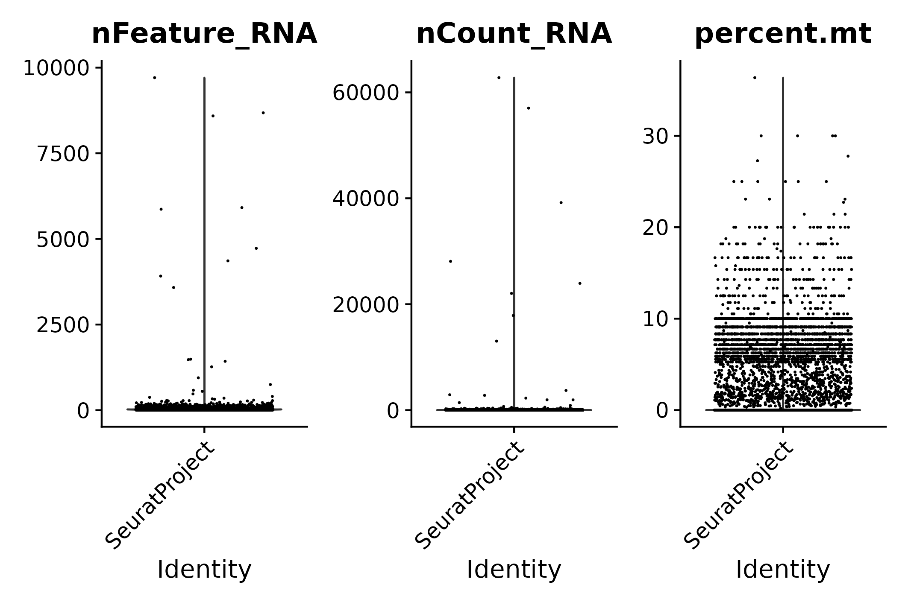
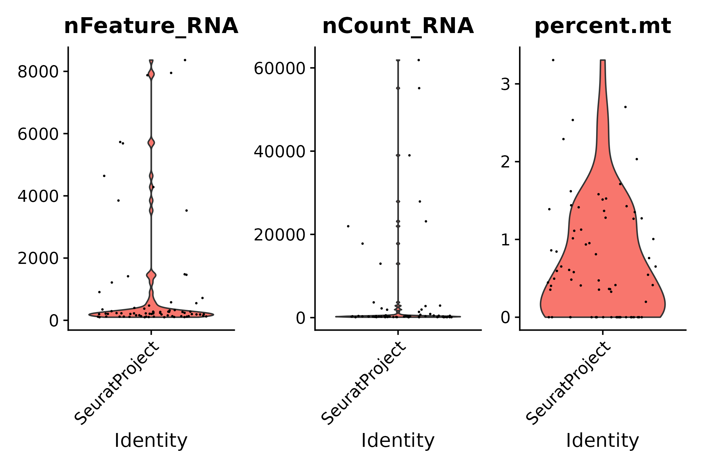
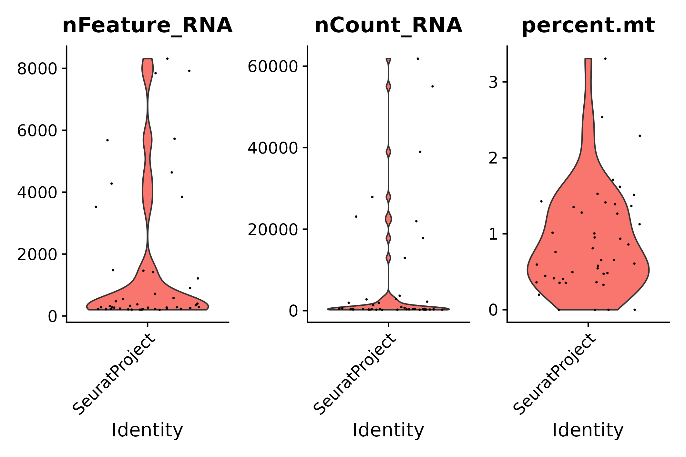
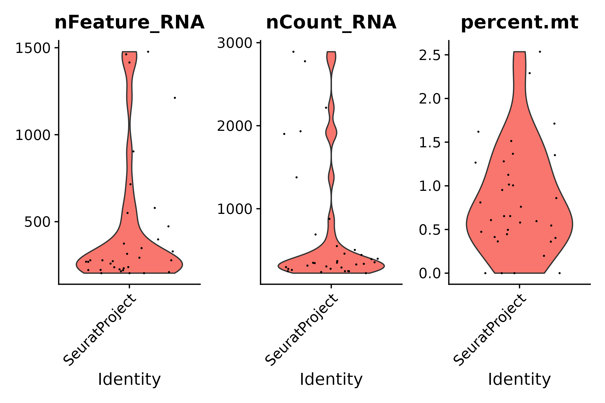
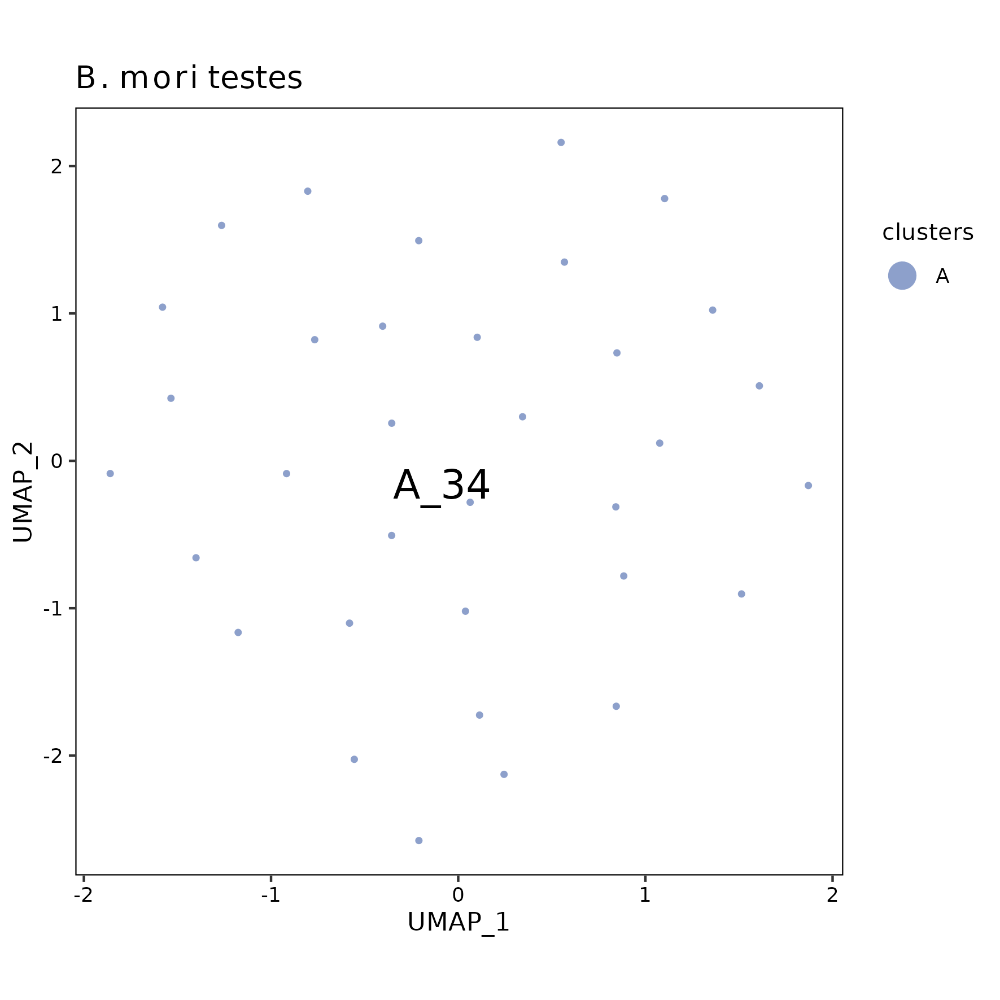

*B. mori* testes analysis using Drop-seq core computational protocol
(T10)
================
Andrea Elizabeth Acurio Armas, Bulah Wu, Petr Nguyen  
October 16, 2024

### FastQC

Output can be found [here (read 1)](../shared/fastqc/read1/fastqc.md)
and [here (read 2)](../shared/fastqc/read2/fastqc.md).

 

### barcodeRanks()

The raw matrix is extracted by selecting cells that have ≥ 10 UMI.

barcodeRanks() output

 

### emptyDrops()

|       | FALSE | TRUE |
|:------|------:|-----:|
| FALSE |   278 |   32 |
| TRUE  |     0 |   40 |

72 cells are identified.

 

### vlnplot()

- The raw matrix
  

  
  

  pre-emptydrops
  

  

|     |  Gene |  Cell | Mean UMI/Cell | Median UMI/Cell | Mean Gene/Cell | Median Gene/Cell |
|:----|------:|------:|--------------:|----------------:|---------------:|-----------------:|
| Raw | 12019 | 18930 |      34.21463 |              13 |       21.06413 |               13 |

 

- After emptyDrops()
  

  
  

  post-emptydrops
  

  

|  | Gene | Cell | Mean UMI/Cell | Median UMI/Cell | Mean Gene/Cell | Median Gene/Cell |
|:---|---:|---:|---:|---:|---:|---:|
| emptyDrops | 12019 | 72 | 4110.708 | 271.5 | 1041.625 | 223.5 |

 

- STEP 1: filter genes detected in \< 3 cells
  

  
  

  seurat filter step 1
  

  

|       | Gene | Cell | Mean UMI/Cell | Median UMI/Cell | Mean Gene/Cell | Median Gene/Cell |
|:------|-----:|-----:|--------------:|----------------:|---------------:|-----------------:|
| Step1 | 8580 |   72 |      4047.264 |             269 |       990.1111 |            222.5 |

 

- STEP 2: filter cells that contain \< 200 genes detected
  

  
  

  seurat filter step 2
  

  

|       | Gene | Cell | Mean UMI/Cell | Median UMI/Cell | Mean Gene/Cell | Median Gene/Cell |
|:------|-----:|-----:|--------------:|----------------:|---------------:|-----------------:|
| Step2 | 8497 |   44 |      6517.341 |           395.5 |        1530.75 |              322 |

 

- STEP 3.1: following STEP 2, filter cells that contain ≤ 200 genes or ≥
  2500 genes detected
  

  
  

  seurat filter step 3.1
  

  

|  | Gene | Cell | Mean UMI/Cell | Median UMI/Cell | Mean Gene/Cell | Median Gene/Cell |
|:---|---:|---:|---:|---:|---:|---:|
| Step3.1 | 8497 | 34 | 685.9412 | 349.5 | 452.5588 | 278 |

 

- STEP 3.2: following STEP 2, filter cells that contain ≥ 5%
  mitochondrial counts
  

  
  

  seurat filter step 3.2
  

  

|  | Gene | Cell | Mean UMI/Cell | Median UMI/Cell | Mean Gene/Cell | Median Gene/Cell |
|:---|---:|---:|---:|---:|---:|---:|
| Step3.2 | 8497 | 44 | 6517.341 | 395.5 | 1530.75 | 322 |

 

- STEP 3: following STEP 2, filter cells that contain ≤ 200 genes or ≥
  2500 genes detected, and filter cells that contain ≥ 5% mitochondrial
  counts
  

  
  

  seurat filter step 3
  

  

|       | Gene | Cell | Mean UMI/Cell | Median UMI/Cell | Mean Gene/Cell | Median Gene/Cell |
|:------|-----:|-----:|--------------:|----------------:|---------------:|-----------------:|
| Step3 | 8497 |   34 |      685.9412 |           349.5 |       452.5588 |              278 |

 

- Summary

|  | Gene | Cell | Mean UMI/Cell | Median UMI/Cell | Mean Gene/Cell | Median Gene/Cell |
|:---|---:|---:|---:|---:|---:|---:|
| Raw | 12019 | 18930 | 34.21463 | 13.0 | 21.06413 | 13.0 |
| emptyDrops | 12019 | 72 | 4110.70833 | 271.5 | 1041.62500 | 223.5 |
| Step1 | 8580 | 72 | 4047.26389 | 269.0 | 990.11111 | 222.5 |
| Step2 | 8497 | 44 | 6517.34091 | 395.5 | 1530.75000 | 322.0 |
| Step3.1 | 8497 | 34 | 685.94118 | 349.5 | 452.55882 | 278.0 |
| Step3.2 | 8497 | 44 | 6517.34091 | 395.5 | 1530.75000 | 322.0 |
| Step3 | 8497 | 34 | 685.94118 | 349.5 | 452.55882 | 278.0 |

 

### UMAP

umap

 
