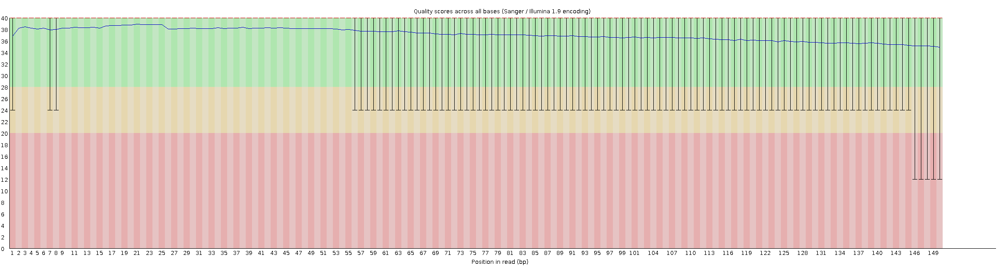
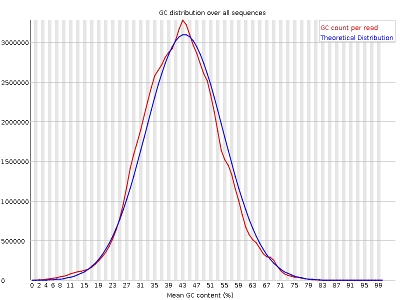

# __FastQC Report__

## :white_check_mark: __Basic Statistics__

| Measure | Value |
| --- | --- |
| Filename | BM_15_MKDL240006979-1A_22GVLLLT4_L8_1.fq.gz |
| File type | Conventional base calls |
| Encoding | Sanger / Illumina 1.9 |
| Total Sequences | 86056925 |
| Sequences flagged as poor quality | 0 |
| Sequence length | 150 |
| %GC | 42 |

## :white_check_mark: __Per base sequence quality__

## :x: __Per tile sequence quality__

## :white_check_mark: __Per sequence quality scores__

## :x: __Per base sequence content__

## :white_check_mark: __Per sequence GC content__

## :white_check_mark: __Per base N content__

## :white_check_mark: __Sequence Length Distribution__

## :x: __Sequence Duplication Levels__

## :white_check_mark: __Overrepresented sequences__

No overrepresented sequences

## :white_check_mark: __Adapter Content__

